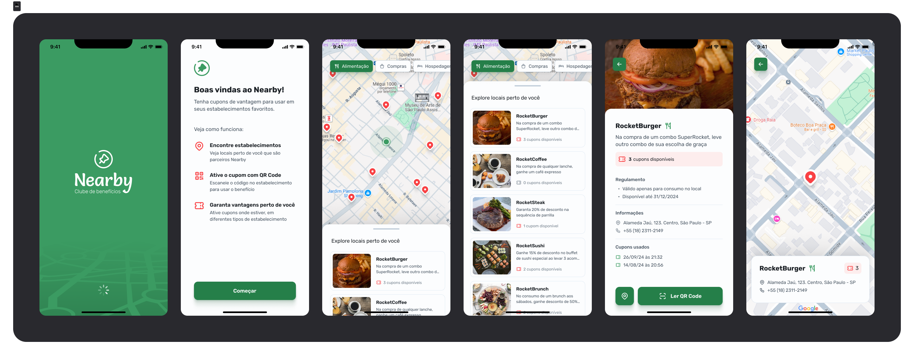

  
  
  


# Nearby: Clube de Benefícios ✏️



> O projeto **Nearby App** é um aplicativo mobile de clube de benefícios com cupons para utilizar em estabelecimentos próximos de você.

### 📚 Stack

| Mobile                                                                                                              | API                                                                                                               |
| ------------------------------------------------------------------------------------------------------------------- | ----------------------------------------------------------------------------------------------------------------- |
|              |         |
|  |                                  |
|    |  |
|                                                                                                                     |              |
|                                                                                                                     |              |

### 🔗 Features

- [x] Scanner de QR Code para cupons em estabelecimentos
- [x] Visualização de mapa em tempo real

  `Na versão de desenvolvimento utiliza-se uma localização pré-definida`

- [x] Visualização de estabelecimentos próximos com promoções disponíveis

  `Na versão de desenvolvimento, as localizações dos estabelecimentos são fictícias`

## 💻 Pré-requisitos

Antes de começar, verifique se sua máquina atende aos seguintes requisitos:

- `NodeJs` versão 20 ou superior
- Gerenciador de pacotes: `npm`

## 🚀 Instalando Nearby

Para instalar o Nearby, siga estas etapas:

**Windows, Linux e macOS:**

1. Clone o repositório:
   ```bash
   git clone https://github.com/nielassis/nearby-app.git
   cd nearby-app
   ```

## ☕ Usando a Nearby API

#### Para usar a Nearby API, siga estas etapas:

1. Entre no diretório da API:

   ```bash
   cd api
   ```

2. Instale as dependências:

   ```bash
   npm install
   ```

3. Execute o servidor:
   ```bash
   npm run start
   ```

## 📱 Usando o Nearby App

#### Para usar o Nearby App, siga estas etapas:

1. Entre no diretório do mobile:

   ```bash
   cd mobile
   ```

2. Instale as dependências:

   ```bash
   npm install
   ```

3. Execute o Expo Go:
   ```bash
   npx expo start
   ```

---
